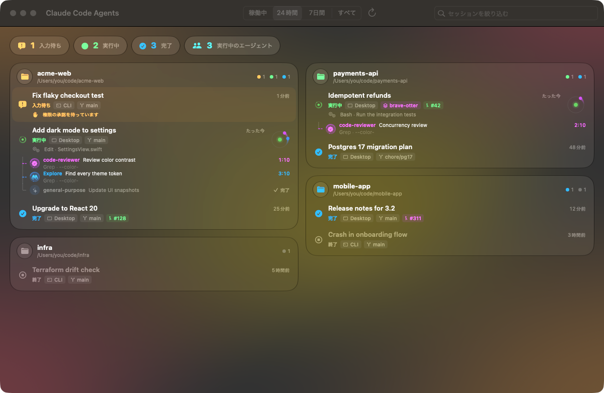
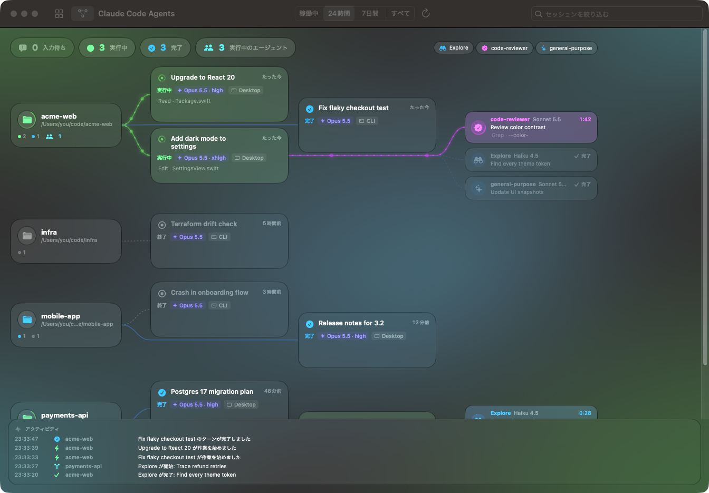

# Claude Code Agents Visualizer

**Mac 上のすべての Claude Code セッションを 1 画面で。** どのプロジェクトにどのセッションがあり、どれが作業中で、
どれがあなたの返事を待っているか。セッションが起動したサブエージェントもリアルタイムで表示します。
セッションをクリックすると Claude for Mac でそのセッションが開きます。

[English README](README.md)





## なぜ作ったか

Claude Code と Claude for Mac のおかげで、複数のプロジェクトで多数のセッションを同時に動かせるようになりました。
一方で「どのセッションが権限の承認待ちで止まっているか」「あのレビューエージェントはまだ動いているか」
「別のリポジトリで何をしていたか」を一覧する手段はありません。このアプリはそれを一目で答えます。

## 機能

- **全セッションをプロジェクトごとに表示**。git worktree はメインのリポジトリにまとめ、Claude for Mac の
  スクラッチフォルダは 1 枚のカードにまとめます。
- **セッションの状態をリアルタイムに表示**:
  | 状態 | 意味 |
  | --- | --- |
  | **入力待ち** | あなたの操作待ち（権限の承認、質問への回答、ダイアログ）。カードがオレンジに光ります。 |
  | **実行中** | ターンの処理中。使用中のツールも表示します（例: `Bash · Run the tests`）。 |
  | **完了** | プロセスは生きていて、直前のターンが終わり次の指示を待っている状態。 |
  | **終了** | セッションを保持するプロセスがない状態。 |
- **未読のセッション**: 別の画面を見ている間に完了したセッションには、Claude for Mac のサイドバーと同じ未読の
  ドットが付き、上部に「未読」の件数が出ます。未読のセッションは Claude for Mac で開くまで、表示範囲に関係なく
  一覧とメニューバーに表示します。ターミナルや IDE で始めたセッションは Claude for Mac が既読を管理しないため、
  未読にはなりません。
- **稼働中セッションのサブエージェント**をツリー表示。種類・説明・経過時間・いま何をしているか・
  終わり方（完了 / 失敗 / 停止 / 中断）を表示します。実行中のエージェントはセッションの周りを周回し、
  セッションから各エージェントへ点線が流れます。
- **エージェントグラフのページ**（⌘2）: プロジェクト → セッション → エージェントを、動いているネットワークとして
  表示します。作業中の経路には光る粒子が流れ、各ノードにはモデル（例: `Opus 5.5 · xhigh`）と実行中の作業を表示します。
  下部のアクティビティログには、エージェントの開始・完了、セッションの開始・ターン完了・入力待ちが流れます。
  セッションは半段ずらした 2 列に並べるので、セッションの多いプロジェクトも 1 画面に収まります。ノードの位置は
  固定です（プロジェクトは名前順、セッションは開始の古い順で、新しいセッションは末尾に追加）。⌘1 でカード型の
  ダッシュボードに戻ります。
- **クリックで Claude for Mac のセッションを開く**。ターミナルや IDE で始めたセッションは、確認のうえで
  Claude for Mac に取り込みます（`claude --resume` コマンドのコピーも可能）。
- **メニューバー**に入力待ちの件数と、稼働中・未読のセッションの一覧を表示。
- macOS 26 の Liquid Glass デザイン、ライト / ダーク、英語 / 日本語、「視差効果を減らす」設定に対応。
- 表示範囲（稼働中 / 24 時間 / 7 日間 / すべて）の切り替えと、タイトル・プロジェクト・パス・ブランチ・
  エージェントの横断検索。

## 動作環境

- macOS 14 以降。Liquid Glass の見た目は macOS 26 以降で、それより前は半透明マテリアルで表示します。
- [Claude Code](https://github.com/anthropics/claude-code)（CLI、IDE 拡張、Claude for Mac のいずれか）。
  セッションを開くには [Claude for Mac](https://claude.ai/download) が必要です。
- ソースからのビルドには macOS 26 以降の SDK、つまり Command Line Tools（または Xcode）26 以降が必要です
  （`xcrun --show-sdk-version` が 26 以上を表示すること）。ビルドしたアプリは macOS 14 でも動きます。

## インストール

[Releases](https://github.com/moyuu-az/claude-code-agents-visualizer/releases) から最新の `.dmg`（または `.zip`）を
ダウンロードし、アプリを「アプリケーション」へドラッグしてください。アドホック署名で公証されていないため、
初回起動は macOS にブロックされます。**システム設定 › プライバシーとセキュリティ** で **このまま開く** を選んで
ください（macOS 14 では右クリックして **開く**）。各リリースの `SHA256SUMS.txt` でファイルを検証できます。

### ソースからビルド

Xcode は不要で、Command Line Tools だけでビルドできます（SDK の要件は上記の動作環境を参照）。

```bash
git clone https://github.com/moyuu-az/claude-code-agents-visualizer.git
```

```bash
cd claude-code-agents-visualizer && scripts/build-app.sh
```

```bash
open "build/Claude Code Agents Visualizer.app"
```

`scripts/package.sh` はリリースと同じ `.dmg` と `.zip` を作ります（`UNIVERSAL=1` で arm64 + x86_64）。

## 仕組み

このアプリは**読み取り専用**で、**ネットワーク通信を一切しません**。2 秒ごとに次のローカルファイルを読みます。

| データ | 用途 |
| --- | --- |
| `~/.claude/sessions/<pid>.json` | 稼働中のプロセスとその状態（`busy` / `waiting` / `idle`）。PID は、プロセスの開始時刻がセッションの登録時刻（Claude Code が記録する `startedAt`）より前の場合だけ有効とみなすため、再利用された PID で終了済みのセッションが稼働中に見えることはありません。 |
| `~/Library/Application Support/Claude/claude-code-sessions/…` | Claude for Mac のセッション一覧（タイトル、ディープリンク用の ID、アーカイブ、プルリクエスト）。 |
| `~/Library/Application Support/Claude/Local Storage/leveldb/` | Claude for Mac の未読セッション（Local Storage = LevelDB の `epitaxy-unread-v1`）。読むのはこの値だけです。ロックを取らずに読み、書き込みはしません。読み取り中に更新されたファイルは次の更新で読み直します。 |
| `~/.claude/projects/<project>/<session>.jsonl` | 作業ディレクトリ、ブランチ、最初のプロンプト、実行中のツール、サブエージェント（`<session>/subagents/`）。セッションの情報はトランスクリプトの先頭と末尾の 512 KB から読みます。サブエージェントを追跡するため、サブエージェントのある稼働中セッションのトランスクリプトは `<task-notification>` を探して一度だけ全体を（8 MB 単位で）走査し、以降は追記された部分だけを読みます。変更のないファイルは読み直しません。 |

サブエージェントは稼働中のセッションについてのみ表示します。自身のトランスクリプトが最終回答かユーザーの中断で
終わっているとき、または親セッションがそのエージェントの `<task-notification>` を受け取ったときに終了とみなします。
最後の記録がセッションの現在のプロセスの起動より前にある未完了エージェント（クラッシュやアプリの再起動の後に
セッションが再開された場合）は「中断」と表示します。

セッションは Claude for Mac の URL スキームで開きます。デスクトップのセッションは
`claude://code/continue?session=local_…`、それ以外は `claude://resume?session=<uuid>` です。
URL に入れる ID は事前に検証します。

常時動くアニメーションは Core Animation（ウィンドウサーバ側）で描画するため、エージェントが動いている間も
アプリの CPU 使用率はほぼ 0% です。

### 制約

- 上記のファイルは Claude Code / Claude for Mac の内部形式で、公開 API ではありません。将来のバージョンで
  変わる可能性があり、その場合アプリは読めない部分を読み飛ばします（落ちません）。おかしな表示があれば
  Issue で教えてください。
- SSH 経由のセッション（Claude for Mac のリモートフォルダ）はローカルにプロセスがありません。ミラーされた
  トランスクリプトがターンの途中で、かつ 2 分以内に更新されていれば実行中、それ以外は終了と表示します。
- クラウドのセッション（claude.ai）は表示しません。

### 設定

| 環境変数 | 効果 |
| --- | --- |
| `CLAUDE_CONFIG_DIR` | Claude Code と同じく `.claude` の場所を指定します。 |
| `AGENTS_VISUALIZER_DESKTOP_SESSIONS_DIR` | Claude for Mac のセッション一覧を別のフォルダから読みます（デモやデバッグ用）。 |

Finder や Dock から開いたアプリには、シェルの設定ファイルで定義した環境変数は渡りません。アプリを終了し、
変数を設定したターミナルから `open "/Applications/Claude Code Agents Visualizer.app"` で起動してください。

`"/Applications/Claude Code Agents Visualizer.app/Contents/MacOS/AgentsVisualizer" --dump-json` はダッシュボードが
見ている内容をそのまま出力します。不具合報告に役立ちますが、セッションのタイトルやパスを含むため、共有する前に
内容を確認してください。

## 開発

```
Sources/AgentsVisualizerCore   データ層: 読み込み、状態判定、ディープリンク（UI なし、テスト済み）
Sources/AgentsVisualizer       SwiftUI アプリ: ダッシュボード、メニューバー、Core Animation のビュー
Tests/AgentsVisualizerCoreTests  ディスク上のフィクスチャを使う swift-testing のテスト
scripts/                      build-app.sh, package.sh, test.sh, demo.py, make-icon.swift
```

```bash
scripts/test.sh
```

```bash
scripts/build-app.sh && python3 scripts/demo.py
```

`scripts/demo.py` はビルド済みのアプリを架空のセッションで起動し、エージェントの完了・起動やセッションの状態変化を
短いシナリオで再生します。UI の開発やスクリーンショットで実際のプロジェクトを写さずに済みます。
アプリへの引数はバイナリのパスの後に渡せます（例: `-page graph -AppleLanguages "(ja)"`）。プルリクエストの前に [CONTRIBUTING.md](CONTRIBUTING.md) をお読みください。

## ライセンス

[MIT](LICENSE)

本プロジェクトは個人による非公式のもので、Anthropic とは提携・承認・後援の関係にありません。
「Claude」「Claude Code」は Anthropic, PBC の商標です。
