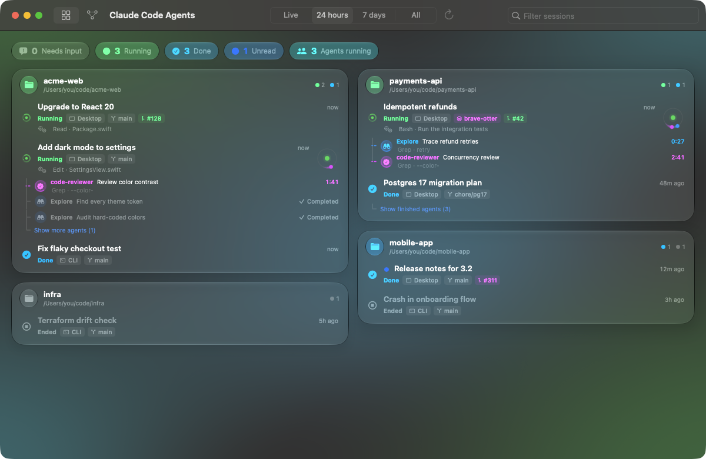

# Claude Code Agents Visualizer

**Every Claude Code session on your Mac, on one screen.** Which projects have sessions, which ones are working,
which ones are waiting for you, and every subagent they spawned — live. Click a session to jump to it in
Claude for Mac.

[日本語版 README](README.ja.md)



## Why

Claude Code and Claude for Mac make it easy to run many sessions across many projects at once. What they do not
give you is the overview: *"Which session is blocked on a permission prompt? Is that review agent still running?
What was I doing in the other repo?"* This app answers that at a glance.

## Features

- **All sessions, grouped by project.** Git worktrees fold into their main repository; Claude Desktop's scratch
  folders share one card.
- **Live status** for each session:
  | Status | Meaning |
  | --- | --- |
  | **Needs input** | Blocked on you: a permission prompt, a question, an open dialog. The card glows orange. |
  | **Running** | A turn is in progress. The tool currently in use is shown (e.g. `Bash · Run the tests`). |
  | **Done** | The process is alive and the last turn finished; it waits for your next prompt. |
  | **Ended** | No live process holds the session. |
- **Subagents of live sessions** as a tree under the session: type, description, live stopwatch, what the agent is
  doing right now, and how it ended (completed / failed / stopped / interrupted). Running agents orbit their
  session; dashes flow from the session to each working agent.
- **One click to open** the session in Claude for Mac. Sessions started in a terminal or IDE are imported into
  Claude for Mac after a confirmation (or copy the `claude --resume` command instead).
- **Menu bar extra** with the number of sessions that need you, and a compact list of live sessions.
- Liquid Glass design on macOS 26, light and dark mode, English and Japanese, Reduce Motion respected.
- Filters (live / 24 hours / 7 days / all) and search across titles, projects, paths, branches and agents.

## Requirements

- macOS 14 or later. The Liquid Glass look needs macOS 26; earlier versions use translucent materials.
- [Claude Code](https://github.com/anthropics/claude-code) (CLI, IDE extension or Claude for Mac). Opening sessions needs
  [Claude for Mac](https://claude.ai/download).
- Building from source needs the macOS 26 SDK or later: the Command Line Tools (or Xcode) 26 or later
  (`xcrun --show-sdk-version` prints 26 or higher). The app it builds still runs on macOS 14.

## Install

Build from source (no Xcode needed; the Command Line Tools are enough):

```bash
git clone https://github.com/moyuu-az/claude-code-agents-visualizer.git
```

```bash
cd claude-code-agents-visualizer && scripts/build-app.sh
```

```bash
open "build/Claude Code Agents Visualizer.app"
```

Move the app to `/Applications` to keep it. Builds from CI (the `app` artifact of each workflow run; downloading
needs a GitHub account) are ad-hoc signed, not notarized, so macOS blocks the first launch: open **System Settings ›
Privacy & Security** and click **Open Anyway** (on macOS 14, right-click the app and choose **Open** instead).

## How it works

The app is **read-only** and makes **no network requests**. Every 2 seconds it reads three local sources:

| Source | Used for |
| --- | --- |
| `~/.claude/sessions/<pid>.json` | Which sessions have a live process and their status (`busy` / `waiting` / `idle`). A PID only counts if its process started before the session registered (the `startedAt` Claude Code records), so a recycled PID does not make a dead session look live. |
| `~/Library/Application Support/Claude/claude-code-sessions/…` | Claude for Mac's session list: titles, desktop ids for deep links, archived flags, pull requests. |
| `~/.claude/projects/<project>/<session>.jsonl` | Everything else: working directory, branch, first prompt, the tool in flight, subagents (`<session>/subagents/`). Session details come from the first and last 512 KB of a transcript. To track subagents, the transcript of a live session that has any is also scanned once for `<task-notification>` entries (in 8 MB chunks), then only the bytes appended since. Unchanged files are not re-read. |

Subagents are listed for live sessions only. One counts as finished when its own transcript ends with a final
answer or a user interrupt, or when the parent session received a `<task-notification>` for it; an unfinished agent
last heard from before the session's current process started (the session was resumed after a crash or an app
restart) is shown as interrupted.

Sessions open through Claude for Mac's URL scheme: `claude://code/continue?session=local_…` for desktop sessions
and `claude://resume?session=<uuid>` for the rest. Ids are validated before they are put in a URL.

Continuous animations run in Core Animation (the window server), so the app stays near 0% CPU while agents work.

### Limitations

- The files above are internal to Claude Code and Claude for Mac, not a public API. A future version can change
  them; the app then skips what it cannot read instead of crashing. Please open an issue if something looks off.
- Sessions running over SSH (Claude for Mac's remote folders) have no local process: they show as running while
  their mirrored transcript is mid-turn and was written in the last 2 minutes, otherwise as ended.
- Cloud sessions (claude.ai) are not listed.

### Configuration

| Environment variable | Effect |
| --- | --- |
| `CLAUDE_CONFIG_DIR` | Same as for Claude Code: where `.claude` lives. |
| `AGENTS_VISUALIZER_DESKTOP_SESSIONS_DIR` | Read Claude for Mac's session index from another folder (demos, debugging). |

An app opened from Finder or the Dock does not see variables set in your shell profile. Quit the app and start it
from a terminal where they are set: `open "/Applications/Claude Code Agents Visualizer.app"`.

`"/Applications/Claude Code Agents Visualizer.app/Contents/MacOS/AgentsVisualizer" --dump-json` prints exactly what
the dashboard sees, which helps when reporting a bug (review it before sharing: it contains your session titles and
paths).

## Development

```
Sources/AgentsVisualizerCore   data layer: readers, status logic, deep links (no UI, fully tested)
Sources/AgentsVisualizer       SwiftUI app: dashboard, menu bar, Core Animation views
Tests/AgentsVisualizerCoreTests  swift-testing suites with on-disk fixtures
scripts/                      build-app.sh, test.sh, demo.py, make-icon.swift
```

```bash
scripts/test.sh
```

```bash
scripts/build-app.sh && python3 scripts/demo.py
```

`scripts/demo.py` launches the built app against made-up sessions, so UI work and screenshots never expose real
projects. See [CONTRIBUTING.md](CONTRIBUTING.md) before opening a pull request.

## License

[MIT](LICENSE)

This is an independent project. It is not affiliated with, endorsed by or sponsored by Anthropic.
"Claude" and "Claude Code" are trademarks of Anthropic, PBC.
